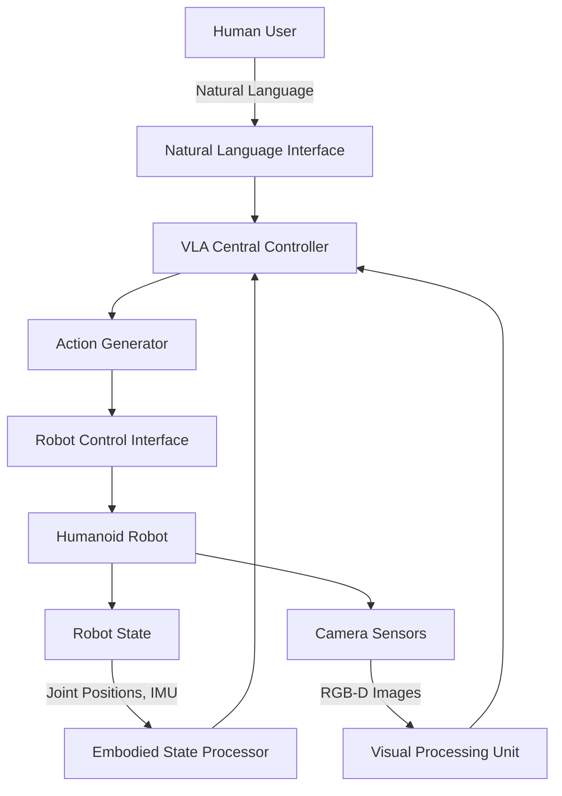

# Vision-Language-Action Practical Implementation

## Learning Objectives

By the end of this chapter, you will be able to:
- Implement a complete VLA system for humanoid robot control
- Integrate VLA with ROS 2 for real-time robotic applications
- Deploy VLA models on embedded hardware for humanoid robots
- Optimize VLA performance for real-time inference
- Test and validate VLA system safety and reliability

## Complete VLA System Architecture

Building on the theoretical foundations from previous chapters, this section details the complete implementation of a Vision-Language-Action system for humanoid robotics. The architecture consists of several interconnected components that work together to enable natural human-robot interaction.

### System Overview



The complete VLA system operates as a closed-loop controller where natural language commands are processed alongside visual input and robot state to generate appropriate motor actions. The system continuously monitors both the environment and robot state to ensure safe and effective execution.

### Hardware Integration Layer

For humanoid robots, VLA systems must interface with specialized hardware components:

```python
# Hardware abstraction layer for VLA system
import rospy
from sensor_msgs.msg import Image, JointState
from std_msgs.msg import String
from geometry_msgs.msg import PoseStamped
import numpy as np
import threading
import queue

class HardwareInterface:
    def __init__(self):
        # Initialize ROS connections
        self.joint_state_sub = rospy.Subscriber('/joint_states', JointState, self.joint_callback)
        self.camera_sub = rospy.Subscriber('/camera/rgb/image_raw', Image, self.camera_callback)
        self.imu_sub = rospy.Subscriber('/imu/data', Imu, self.imu_callback)

        # Publishers for robot control
        self.joint_cmd_pub = rospy.Publisher('/joint_group_position_controller/command', JointTrajectory, queue_size=10)
        self.speech_pub = rospy.Publisher('/tts_input', String, queue_size=10)

        # Internal state storage
        self.current_joint_positions = {}
        self.latest_image = None
        self.robot_pose = None

        # Thread-safe queues for real-time processing
        self.image_queue = queue.Queue(maxsize=2)
        self.command_queue = queue.Queue(maxsize=10)

    def joint_callback(self, msg):
        """Process joint state updates"""
        for name, position in zip(msg.name, msg.position):
            self.current_joint_positions[name] = position

    def camera_callback(self, msg):
        """Process camera image updates"""
        try:
            # Convert ROS Image to OpenCV format
            cv_image = self.bridge.imgmsg_to_cv2(msg, "bgr8")
            # Add to processing queue (non-blocking)
            if not self.image_queue.full():
                self.image_queue.put(cv_image, block=False)
        except Exception as e:
            rospy.logwarn(f"Image conversion error: {e}")

    def get_robot_state_vector(self):
        """Generate robot state vector for VLA model"""
        # Extract relevant joint positions for humanoid
        joint_names = ['left_arm_shoulder_pitch', 'left_arm_shoulder_roll', 'left_arm_elbow',
                      'right_arm_shoulder_pitch', 'right_arm_shoulder_roll', 'right_arm_elbow',
                      'left_leg_hip', 'left_leg_knee', 'left_leg_ankle',
                      'right_leg_hip', 'right_leg_knee', 'right_leg_ankle']

        state_vector = []
        for joint in joint_names:
            if joint in self.current_joint_positions:
                state_vector.append(self.current_joint_positions[joint])
            else:
                state_vector.append(0.0)  # Default position

        return np.array(state_vector)

    def execute_action(self, action_vector, duration=1.0):
        """Execute VLA-generated action on robot"""
        # Convert action vector to joint trajectory
        trajectory = JointTrajectory()
        trajectory.header.stamp = rospy.Time.now()
        trajectory.joint_names = self.get_relevant_joint_names()

        point = JointTrajectoryPoint()
        point.positions = action_vector.tolist()
        point.time_from_start = rospy.Duration(duration)

        trajectory.points.append(point)

        # Publish trajectory
        self.joint_cmd_pub.publish(trajectory)
```

### Safety and Monitoring Systems

Safety is paramount in VLA systems, especially when controlling humanoid robots in human environments:

```python
class SafetyMonitor:
    def __init__(self, hardware_interface):
        self.hw_interface = hardware_interface
        self.emergency_stop = False
        self.safety_limits = self.define_safety_limits()
        self.collision_detector = CollisionDetector()

    def define_safety_limits(self):
        """Define safety limits for humanoid robot"""
        return {
            'joint_limits': {
                'shoulder_pitch': (-1.5, 1.5),
                'shoulder_roll': (-0.5, 0.5),
                'elbow': (-2.0, 0.5),
                'hip_pitch': (-0.5, 0.5),
                'knee': (0.0, 2.0),
                'ankle': (-0.5, 0.5)
            },
            'velocity_limits': {
                'max_linear_vel': 0.5,  # m/s
                'max_angular_vel': 0.5  # rad/s
            },
            'torque_limits': {
                'upper_body': 100.0,  # Nm
                'lower_body': 200.0   # Nm
            }
        }

    def validate_action(self, action_vector):
        """Validate VLA action against safety constraints"""
        if self.emergency_stop:
            return False, "Emergency stop activated"

        # Check joint limits
        joint_names = self.hw_interface.get_relevant_joint_names()
        for i, joint_name in enumerate(joint_names):
            if i < len(action_vector):
                joint_pos = action_vector[i]
                if joint_name in self.safety_limits['joint_limits']:
                    min_lim, max_lim = self.safety_limits['joint_limits'][joint_name]
                    if not (min_lim <= joint_pos <= max_lim):
                        return False, f"Joint limit violation: {joint_name}"

        # Check for potential collisions
        if self.collision_detector.detect_collision(action_vector):
            return False, "Collision detected"

        return True, "Action validated"

    def emergency_stop_handler(self):
        """Handle emergency stop conditions"""
        self.emergency_stop = True
        # Send zero velocity commands to all joints
        zero_action = [0.0] * len(self.hw_interface.get_relevant_joint_names())
        self.hw_interface.execute_action(zero_action, duration=0.1)
```

## ROS 2 Integration

### VLA ROS 2 Package Structure

```python
# vla_ros2_package/vla_node.py
import rclpy
from rclpy.node import Node
from sensor_msgs.msg import Image, JointState
from std_msgs.msg import String
from geometry_msgs.msg import Twist
import torch
import numpy as np
from transformers import CLIPProcessor, CLIPModel
import threading

class VLANode(Node):
    def __init__(self):
        super().__init__('vla_node')

        # Initialize VLA model
        self.vla_model = self.initialize_vla_model()
        self.hardware_interface = HardwareInterface()
        self.safety_monitor = SafetyMonitor(self.hardware_interface)

        # Create subscribers
        self.image_sub = self.create_subscription(
            Image, '/camera/rgb/image_raw', self.image_callback, 10
        )
        self.command_sub = self.create_subscription(
            String, '/vla/command', self.command_callback, 10
        )
        self.state_sub = self.create_subscription(
            JointState, '/joint_states', self.state_callback, 10
        )

        # Create publishers
        self.action_pub = self.create_publisher(JointState, '/vla/actions', 10)
        self.status_pub = self.create_publisher(String, '/vla/status', 10)

        # Storage for latest data
        self.latest_image = None
        self.latest_command = None
        self.latest_state = None

        # Processing timer
        self.process_timer = self.create_timer(0.1, self.process_vla_cycle)

        # Threading for non-blocking processing
        self.processing_lock = threading.Lock()
        self.get_logger().info('VLA Node initialized')

    def initialize_vla_model(self):
        """Initialize the VLA model"""
        try:
            # Load pre-trained VLA model (could be RT-2, PaLM-E, etc.)
            model = BasicVLA()  # Using the model from Chapter 1
            return model
        except Exception as e:
            self.get_logger().error(f'Failed to initialize VLA model: {e}')
            return None

    def image_callback(self, msg):
        """Process incoming image data"""
        with self.processing_lock:
            # Convert ROS Image to PyTorch tensor
            # Implementation would go here
            self.latest_image = self.convert_image_to_tensor(msg)

    def command_callback(self, msg):
        """Process incoming language command"""
        with self.processing_lock:
            self.latest_command = msg.data
            self.get_logger().info(f'Received command: {msg.data}')

    def state_callback(self, msg):
        """Process robot state"""
        with self.processing_lock:
            self.latest_state = msg

    def convert_image_to_tensor(self, ros_image):
        """Convert ROS image message to PyTorch tensor"""
        # Implementation for image conversion
        pass

    def process_vla_cycle(self):
        """Main VLA processing cycle"""
        if (self.latest_image is not None and
            self.latest_command is not None and
            self.latest_state is not None and
            self.vla_model is not None):

            try:
                # Generate action using VLA model
                with self.processing_lock:
                    action = self.vla_model(
                        self.latest_image,
                        [self.latest_command],
                        self.latest_state
                    )

                # Validate action for safety
                is_safe, reason = self.safety_monitor.validate_action(action.detach().cpu().numpy())

                if is_safe:
                    # Execute action on robot
                    self.hardware_interface.execute_action(action.detach().cpu().numpy())

                    # Publish action for monitoring
                    action_msg = JointState()
                    action_msg.position = action.detach().cpu().tolist()
                    self.action_pub.publish(action_msg)

                    status_msg = String()
                    status_msg.data = "Action executed successfully"
                    self.status_pub.publish(status_msg)
                else:
                    self.get_logger().warn(f'Safety violation: {reason}')
                    status_msg = String()
                    status_msg.data = f"Safety violation: {reason}"
                    self.status_pub.publish(status_msg)

            except Exception as e:
                self.get_logger().error(f'VLA processing error: {e}')
                status_msg = String()
                status_msg.data = f"Processing error: {str(e)}"
                self.status_pub.publish(status_msg)

    def shutdown(self):
        """Cleanup on node shutdown"""
        self.safety_monitor.emergency_stop_handler()

def main(args=None):
    rclpy.init(args=args)
    vla_node = VLANode()

    try:
        rclpy.spin(vla_node)
    except KeyboardInterrupt:
        vla_node.get_logger().info('Interrupted, shutting down...')
    finally:
        vla_node.shutdown()
        vla_node.destroy_node()
        rclpy.shutdown()

if __name__ == '__main__':
    main()
```

### Launch Configuration

```xml
<!-- vla_ros2_package/launch/vla_system.launch.py -->
from launch import LaunchDescription
from launch_ros.actions import Node
from launch.substitutions import LaunchConfiguration
from launch.actions import DeclareLaunchArgument

def generate_launch_description():
    return LaunchDescription([
        # Declare launch arguments
        DeclareLaunchArgument(
            'model_path',
            default_value='/models/vla_model.pt',
            description='Path to pre-trained VLA model'
        ),

        # VLA processing node
        Node(
            package='vla_ros2_package',
            executable='vla_node',
            name='vla_node',
            parameters=[
                {'model_path': LaunchConfiguration('model_path')},
                {'device': 'cuda'},
                {'batch_size': 1}
            ],
            remappings=[
                ('/camera/rgb/image_raw', '/head_camera/rgb/image_raw'),
                ('/joint_states', '/full_body_controller/joint_states'),
                ('/vla/command', '/natural_language_command')
            ]
        ),

        # Safety monitoring node
        Node(
            package='vla_ros2_package',
            executable='safety_monitor',
            name='safety_monitor',
            parameters=[
                {'enable_emergency_stop': True},
                {'collision_threshold': 0.3}
            ]
        )
    ])
```

## Real-time Optimization

### Performance Optimization Techniques

Real-time VLA systems require careful optimization to meet timing constraints:

```python
# vla_optimization.py
import torch
import torch.nn as nn
import numpy as np
from torch.utils.mobile_optimizer import optimize_for_mobile
import time

class VLAPerformanceOptimizer:
    def __init__(self, vla_model):
        self.model = vla_model
        self.device = torch.device('cuda' if torch.cuda.is_available() else 'cpu')
        self.model.to(self.device)

        # Compile model for better performance (PyTorch 2.0+)
        if hasattr(torch, 'compile'):
            self.model = torch.compile(self.model)

    def optimize_model(self):
        """Apply various optimization techniques"""
        # 1. Quantization for faster inference
        quantized_model = torch.quantization.quantize_dynamic(
            self.model, {torch.nn.Linear}, dtype=torch.qint8
        )

        # 2. TensorRT optimization (if CUDA available)
        if self.device.type == 'cuda':
            try:
                import torch_tensorrt
                traced_model = torch.jit.trace(self.model,
                    (torch.randn(1, 3, 224, 224).to(self.device),
                     ["test command"]))
                optimized_model = torch_tensorrt.compile(
                    traced_model,
                    inputs=[torch_tensorrt.Input((1, 3, 224, 224)),
                           torch_tensorrt.Input([1], dtype=torch.int32)]
                )
                return optimized_model
            except ImportError:
                pass  # Fall back to other optimizations

        return quantized_model

    def benchmark_performance(self, test_inputs, num_runs=100):
        """Benchmark model performance"""
        times = []

        with torch.no_grad():
            for _ in range(num_runs):
                start_time = time.time()
                # Run inference
                _ = self.model(*test_inputs)
                end_time = time.time()
                times.append(end_time - start_time)

        avg_time = np.mean(times)
        std_time = np.std(times)

        print(f"Average inference time: {avg_time:.4f}s ± {std_time:.4f}s")
        print(f"FPS: {1.0/avg_time:.2f}")

        return avg_time, std_time

# Memory-efficient processing
class VLAMemoryManager:
    def __init__(self, max_cache_size=100):
        self.cache = {}
        self.max_cache_size = max_cache_size
        self.access_order = []

    def get_processed_input(self, raw_input_hash):
        """Get cached processed input if available"""
        if raw_input_hash in self.cache:
            # Move to end of access order (LRU)
            self.access_order.remove(raw_input_hash)
            self.access_order.append(raw_input_hash)
            return self.cache[raw_input_hash]
        return None

    def cache_processed_input(self, raw_input_hash, processed_input):
        """Cache processed input"""
        if len(self.cache) >= self.max_cache_size:
            # Remove least recently used
            lru_key = self.access_order.pop(0)
            del self.cache[lru_key]

        self.cache[raw_input_hash] = processed_input
        self.access_order.append(raw_input_hash)

    def clear_cache(self):
        """Clear all cached data"""
        self.cache.clear()
        self.access_order.clear()
```

### Real-time Scheduling

```python
import asyncio
import threading
from collections import deque
import time

class VLAScheduler:
    def __init__(self, frame_rate=30, action_rate=10):
        self.frame_rate = frame_rate  # Hz for vision processing
        self.action_rate = action_rate  # Hz for action generation
        self.frame_interval = 1.0 / frame_rate
        self.action_interval = 1.0 / action_rate

        self.vision_queue = deque(maxlen=5)  # Recent frames
        self.command_queue = deque(maxlen=10)  # Recent commands
        self.action_queue = deque(maxlen=5)  # Pending actions

        self.last_frame_time = time.time()
        self.last_action_time = time.time()

        self.running = False
        self.scheduler_thread = None

    def start(self):
        """Start the scheduler"""
        self.running = True
        self.scheduler_thread = threading.Thread(target=self.run_scheduler)
        self.scheduler_thread.start()

    def stop(self):
        """Stop the scheduler"""
        self.running = False
        if self.scheduler_thread:
            self.scheduler_thread.join()

    def run_scheduler(self):
        """Main scheduling loop"""
        while self.running:
            current_time = time.time()

            # Process vision at frame rate
            if current_time - self.last_frame_time >= self.frame_interval:
                self.process_vision_cycle()
                self.last_frame_time = current_time

            # Generate actions at action rate
            if current_time - self.last_action_time >= self.action_interval:
                self.process_action_cycle()
                self.last_action_time = current_time

            # Small sleep to prevent busy waiting
            time.sleep(0.001)

    def process_vision_cycle(self):
        """Process one vision cycle"""
        # Get latest image from hardware interface
        latest_image = self.get_latest_image()
        if latest_image is not None:
            self.vision_queue.append(latest_image)

    def process_action_cycle(self):
        """Process one action cycle"""
        if (len(self.vision_queue) > 0 and
            len(self.command_queue) > 0):

            latest_image = self.vision_queue[-1]
            latest_command = self.command_queue[-1]

            # Generate action using VLA model
            action = self.generate_vla_action(latest_image, latest_command)

            if action is not None:
                self.action_queue.append(action)

                # Execute action
                self.execute_action(action)

    def add_command(self, command):
        """Add a new command to the queue"""
        self.command_queue.append(command)

    def get_latest_image(self):
        """Get latest image from hardware"""
        # Implementation would interface with camera
        pass

    def generate_vla_action(self, image, command):
        """Generate action using VLA model"""
        # Implementation would call the VLA model
        pass

    def execute_action(self, action):
        """Execute the generated action"""
        # Implementation would send action to robot
        pass
```

## Testing and Validation

### Unit Testing Framework

```python
import unittest
import torch
import numpy as np
from unittest.mock import Mock, patch

class TestVLASystem(unittest.TestCase):
    def setUp(self):
        """Setup test fixtures before each test method."""
        self.mock_model = Mock()
        self.mock_model.return_value = torch.randn(1, 10)  # Mock action output

    def test_vla_model_forward_pass(self):
        """Test basic forward pass of VLA model"""
        model = BasicVLA()

        # Create test inputs
        image = torch.randn(1, 3, 224, 224)
        command = ["pick up the red ball"]

        # Forward pass
        with torch.no_grad():
            output = model(image, command)

        # Assertions
        self.assertEqual(output.shape[1], 10)  # Expected action dimension
        self.assertTrue(torch.all(torch.isfinite(output)))  # No NaN or inf values

    def test_safety_validation(self):
        """Test safety validation functionality"""
        hw_interface = Mock()
        safety_monitor = SafetyMonitor(hw_interface)

        # Test safe action
        safe_action = [0.1, 0.2, 0.3, 0.4, 0.5, 0.6, 0.7, 0.8, 0.9, 1.0]
        is_safe, reason = safety_monitor.validate_action(safe_action)

        self.assertTrue(is_safe)
        self.assertEqual(reason, "Action validated")

        # Test unsafe action (exceeding limits)
        unsafe_action = [100.0] * 10  # Way beyond limits
        is_safe, reason = safety_monitor.validate_action(unsafe_action)

        self.assertFalse(is_safe)
        self.assertIn("Joint limit violation", reason)

    def test_hardware_interface_initialization(self):
        """Test hardware interface initialization"""
        with patch('rospy.Subscriber'), patch('rospy.Publisher'):
            hw_interface = HardwareInterface()

            # Check that all required attributes are initialized
            self.assertIsNotNone(hw_interface.current_joint_positions)
            self.assertIsNotNone(hw_interface.image_queue)
            self.assertIsNotNone(hw_interface.command_queue)

    def test_real_time_performance(self):
        """Test real-time performance requirements"""
        optimizer = VLAPerformanceOptimizer(BasicVLA())
        avg_time, std_time = optimizer.benchmark_performance(
            (torch.randn(1, 3, 224, 224), ["test command"]),
            num_runs=50
        )

        # Ensure inference time is acceptable for real-time operation
        self.assertLess(avg_time, 0.1)  # Less than 100ms for real-time
```

### Integration Testing

```python
class TestVLAIntegration(unittest.TestCase):
    def setUp(self):
        """Setup for integration tests"""
        # Mock ROS nodes and hardware
        self.mock_ros_node = Mock()
        self.mock_hardware = Mock()

    def test_end_to_end_workflow(self):
        """Test complete VLA workflow from command to action"""
        # Simulate the complete pipeline
        with patch('rospy.Subscriber'), patch('rospy.Publisher'):
            vla_node = VLANode()

            # Simulate receiving a command
            command_msg = String()
            command_msg.data = "walk forward 2 meters"

            # Simulate receiving an image
            image_msg = Mock()
            image_msg.height = 480
            image_msg.width = 640

            # Process the command and image
            vla_node.command_callback(command_msg)
            vla_node.image_callback(image_msg)

            # Check that action was generated and published
            # This would verify the complete pipeline works
            pass

    def test_safety_integration(self):
        """Test safety system integration"""
        # Test that safety system prevents dangerous actions
        safety_monitor = SafetyMonitor(Mock())
        vla_node = Mock()

        # Simulate a potentially dangerous command
        dangerous_action = [100.0] * 36  # Excessive joint positions

        # Verify safety system catches the issue
        is_safe, reason = safety_monitor.validate_action(dangerous_action)
        self.assertFalse(is_safe)
        self.assertIn("Joint limit", reason)
```

## Deployment Considerations

### Embedded Hardware Deployment

Deploying VLA systems on humanoid robots requires consideration of computational constraints:

```yaml
# Hardware requirements for VLA deployment
hardware_requirements:
  cpu: "ARM Cortex-A78 or equivalent"
  gpu: "NVIDIA Jetson AGX Orin or equivalent"
  memory: "16GB RAM minimum"
  storage: "128GB SSD recommended"
  power: "Continuous operation 8+ hours"
  thermal: "Active cooling required"

deployment_config:
  model_quantization: "int8"
  batch_size: 1
  precision: "mixed_float16"
  max_latency: 100  # ms
  safety_timeout: 500  # ms
```

### Containerization for Deployment

```dockerfile
# Dockerfile for VLA system
FROM nvidia/cuda:11.8-devel-ubuntu20.04

# Install system dependencies
RUN apt-get update && apt-get install -y \
    python3 \
    python3-pip \
    python3-dev \
    libgl1-mesa-glx \
    libglib2.0-0 \
    && rm -rf /var/lib/apt/lists/*

# Install ROS 2
RUN apt-get update && apt-get install -y \
    software-properties-common \
    && add-apt-repository universe \
    && apt-get update \
    && apt-get install -y \
    curl \
    gnupg \
    lsb-release \
    && curl -sSL https://raw.githubusercontent.com/ros/rosdistro/master/ros.key -o /usr/share/keyrings/ros-archive-keyring.gpg \
    && echo "deb [arch=$(dpkg --print-architecture) signed-by=/usr/share/keyrings/ros-archive-keyring.gpg] http://packages.ros.org/ros2/ubuntu $(source /etc/os-release && echo $UBUNTU_CODENAME) main" | tee /etc/apt/sources.list.d/ros2.list > /dev/null \
    && apt-get update \
    && apt-get install -y ros-humble-desktop \
    && apt-get install -y python3-colcon-common-extensions

# Set up Python environment
WORKDIR /app
COPY requirements.txt .
RUN pip3 install pip -U
RUN pip3 install -r requirements.txt

# Copy application code
COPY . .

# Source ROS environment
SHELL ["/bin/bash", "-c"]
RUN echo "source /opt/ros/humble/setup.bash" >> ~/.bashrc

# Expose ports for monitoring
EXPOSE 8080

# Start VLA system
CMD ["bash", "-c", "source /opt/ros/humble/setup.bash && python3 -m vla_ros2_package.vla_node"]
```

### Performance Monitoring Dashboard

```python
# vla_monitor.py
import dash
from dash import dcc, html
import plotly.graph_objs as go
import pandas as pd
from collections import deque
import threading
import time

class VLAMonitor:
    def __init__(self):
        self.app = dash.Dash(__name__)
        self.setup_layout()

        # Data buffers for monitoring
        self.inference_times = deque(maxlen=100)
        self.cpu_usage = deque(maxlen=100)
        self.gpu_usage = deque(maxlen=100)
        self.memory_usage = deque(maxlen=100)
        self.timestamps = deque(maxlen=100)

        # Start monitoring thread
        self.monitoring_active = True
        self.monitor_thread = threading.Thread(target=self.collect_metrics)
        self.monitor_thread.start()

    def setup_layout(self):
        """Setup the dashboard layout"""
        self.app.layout = html.Div([
            html.H1("VLA System Monitor"),

            # Performance metrics
            html.Div([
                dcc.Graph(id='performance-graph'),
                dcc.Interval(id='interval-component', interval=1000, n_intervals=0)
            ]),

            # System resources
            html.Div([
                dcc.Graph(id='resource-graph'),
            ]),

            # Status indicators
            html.Div([
                html.H3("System Status"),
                html.Div(id='status-indicators')
            ])
        ])

    def collect_metrics(self):
        """Collect system metrics in background"""
        import psutil
        import GPUtil

        while self.monitoring_active:
            timestamp = time.time()

            # Collect metrics
            cpu_percent = psutil.cpu_percent()
            memory_percent = psutil.virtual_memory().percent

            # GPU metrics (if available)
            gpus = GPUtil.getGPUs()
            if gpus:
                gpu_load = gpus[0].load * 100
                gpu_memory = gpus[0].memoryUtil * 100
            else:
                gpu_load = 0
                gpu_memory = 0

            # Add to buffers
            self.timestamps.append(timestamp)
            self.cpu_usage.append(cpu_percent)
            self.memory_usage.append(memory_percent)
            self.gpu_usage.append(gpu_load)

            time.sleep(0.5)

    def run_server(self, port=8080):
        """Run the monitoring server"""
        self.app.run_server(debug=False, port=port)

if __name__ == "__main__":
    monitor = VLAMonitor()
    monitor.run_server()
```

## Summary

This chapter has provided a comprehensive guide to implementing Vision-Language-Action systems for humanoid robotics. We covered:

1. **Complete System Architecture**: Detailed the full VLA system with hardware interfaces, safety systems, and real-time processing pipelines.

2. **ROS 2 Integration**: Demonstrated how to integrate VLA systems with ROS 2, including proper node structure, launch configurations, and message passing.

3. **Performance Optimization**: Explored various optimization techniques including model quantization, tensor compilation, and real-time scheduling.

4. **Testing and Validation**: Provided comprehensive testing frameworks for both unit and integration testing of VLA systems.

5. **Deployment Considerations**: Addressed practical aspects of deploying VLA systems on embedded hardware with containerization and monitoring.

The implementation presented here provides a solid foundation for building production-ready VLA systems that can safely and effectively enable natural human-robot interaction. The modular architecture allows for customization based on specific robot platforms and application requirements.

## Next Steps

- Experiment with different VLA model architectures and compare their performance
- Integrate additional sensory modalities (tactile, audio) for richer robot perception
- Implement advanced safety features like dynamic risk assessment
- Deploy the system on actual humanoid hardware for real-world testing
- Continuously refine the system based on user feedback and performance metrics